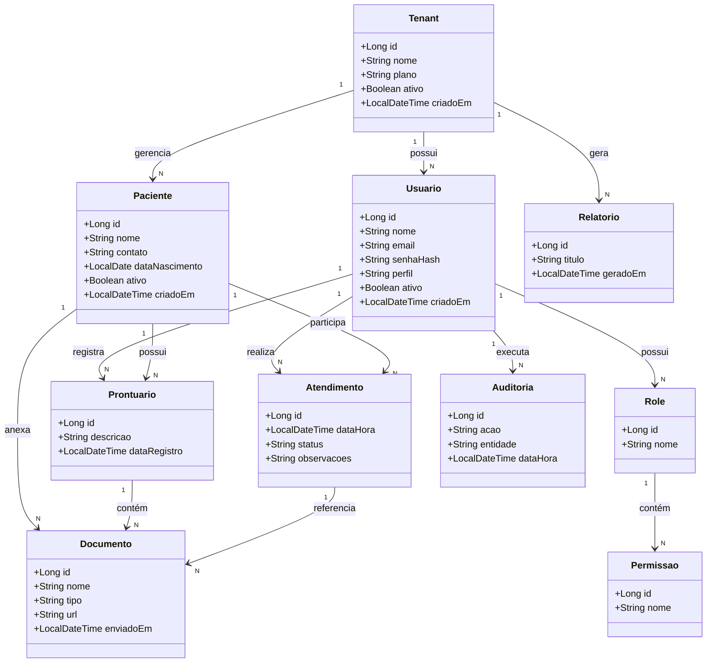

# 🩺 CoreHealth

## 📌 Visão Geral

O **CoreHealth** é um projeto de software com foco em arquitetura SaaS moderna, projetado para demonstrar boas práticas de engenharia de software, organização de domínio, segurança e escalabilidade.

Este repositório possui caráter arquitetural e conceitual, servindo como base para estudos avançados, evolução técnica e avaliação de design de sistemas.

---

## 🎯 Objetivos do Projeto

- Demonstrar arquitetura multi-tenant
- Separação clara de domínios
- Modelo de dados consistente e escalável
- Estrutura preparada para RBAC (roles e permissões)
- Auditoria e rastreabilidade de ações
- Organização alinhada a sistemas SaaS corporativos

---

## 🏗️ Arquitetura Conceitual

- Arquitetura multi-tenant com isolamento lógico
- Controle de acesso baseado em papéis (RBAC)
- Domínio desacoplado de infraestrutura
- Estrutura modular e extensível
- Pensado para aplicações enterprise

---

## 🧰 Stack Utilizada

O projeto foi concebido com foco em **tecnologias modernas**, **padrões amplamente adotados no mercado** e **preparação para ambientes cloud e escaláveis**.

### Backend
- **Java 21**  
- **Spring Boot** (arquitetura RESTful)
- **Spring Data JPA**
- **Spring Security** (base para autenticação e autorização)
- **Hibernate**
- **Maven**
- **API REST**

### Frontend
- **Angular**
- **TypeScript**
- **HTML5 / CSS3**
- **Arquitetura baseada em componentes**
- **Consumo de APIs REST**

### Banco de Dados
- **MySQL** (modelo relacional)
- Estrutura preparada para evolução e migração de provedores

### Infraestrutura & DevOps
- **Docker** (containerização)
- **Docker Compose** (ambientes locais e integração)
- **AWS** (arquitetura cloud-ready)
  - Preparado para uso com serviços como EC2, RDS, ECS e S3
- **Configuração orientada a ambientes** (dev / staging / production)

### Segurança
- **RBAC (Role-Based Access Control)**
- Hash de senhas
- Estrutura preparada para JWT / OAuth2
- Auditoria de ações

### Boas Práticas e Arquitetura
- Arquitetura em camadas
- Separação de responsabilidades
- Código limpo e manutenível
- Preparado para crescimento modular
- Conceitos de domínio bem definidos

---

## 🗄️ Modelo de Dados (Visão Conceitual)

---

🔐 Segurança e Controle de Acesso

Controle de acesso baseado em roles e permissões

Usuários associados a um tenant

Auditoria de ações relevantes

Estrutura preparada para autenticação moderna

---

📊 Auditoria e Observabilidade

Registro de ações críticas

Rastreabilidade por entidade

Base para compliance e governança

---

🚀 Status do Projeto

Projeto em evolução contínua, com foco em:

Qualidade arquitetural

Boas práticas de engenharia

Escalabilidade e manutenção

---

📄 Licença

Projeto privado.
Uso, redistribuição ou comercialização dependem de autorização.
